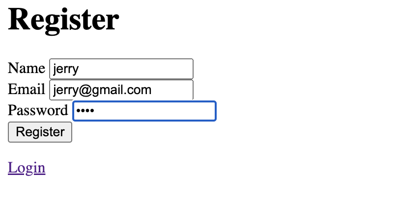
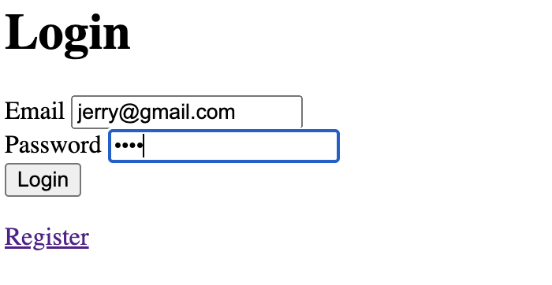

<h1>A simple user authentication system</h1>

    

    Used Express for the server backend and Passport to help manage the logged in state of users. Also properly encrypt and hash all user passwords so that the app is secure
    

    
    
    

